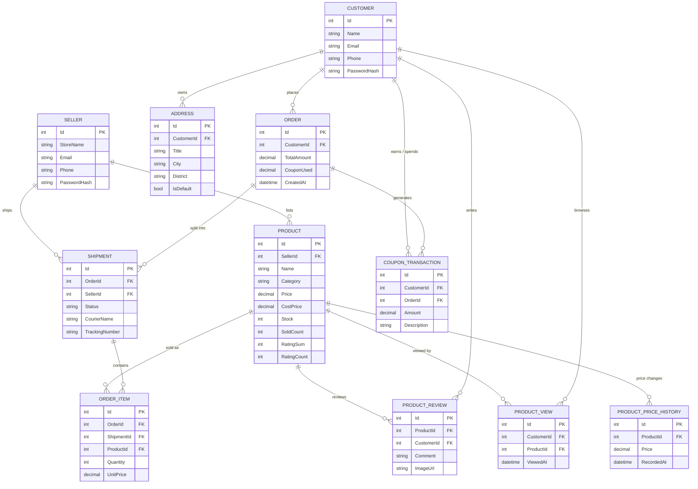
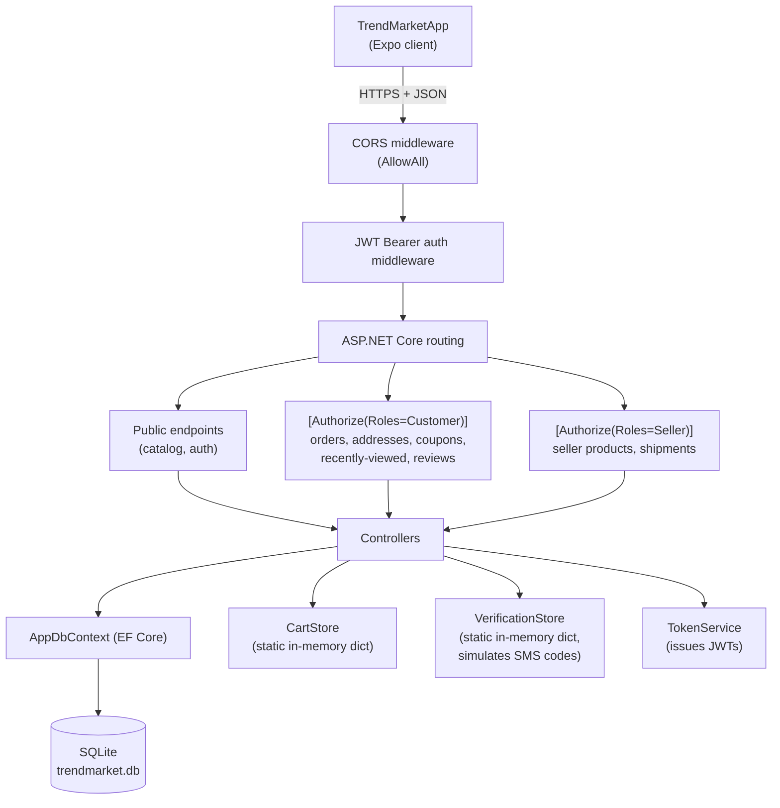
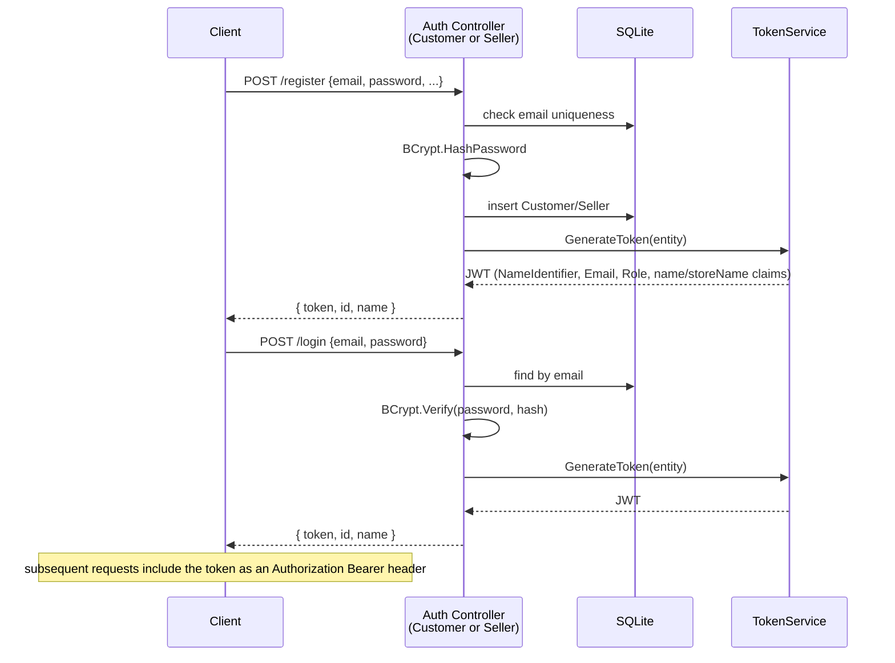
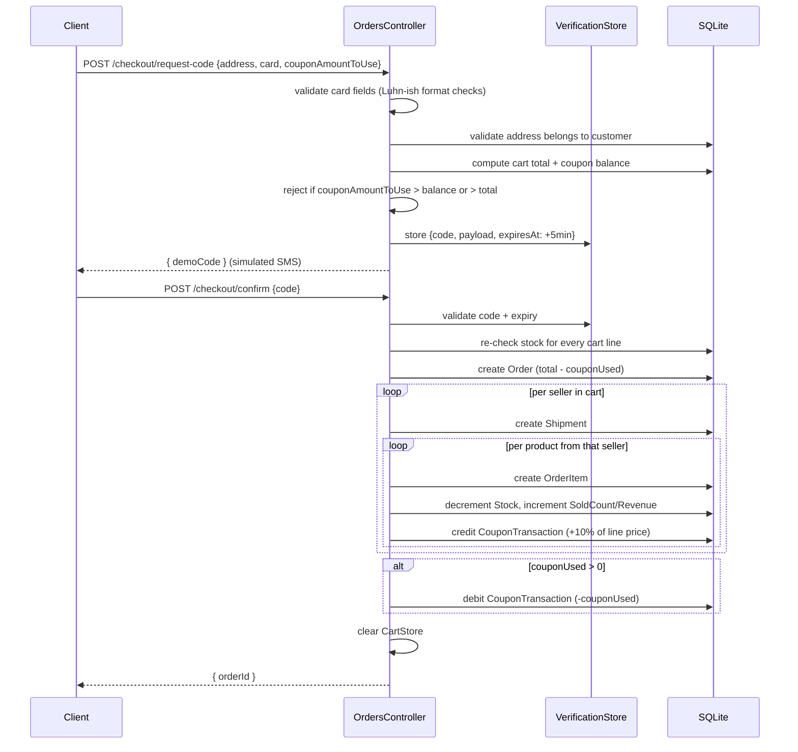

# TrendMarket Backend

ASP.NET Core Web API backend for **TrendMarket**, a demo multi-vendor e-commerce
platform. It serves the [TrendMarketApp](https://github.com/fatmana-ozcan/Trend-Market-App)
Expo/React Native client: product catalog, cart, checkout, order/shipment tracking,
product reviews, a coupon wallet, "30-day lowest price" tracking, and a
"recently viewed" feed.

## Tech Stack

| Layer          | Technology |
|----------------|------------|
| Runtime        | .NET 8 / ASP.NET Core Web API |
| Database       | SQLite via EF Core 8 (`Microsoft.EntityFrameworkCore.Sqlite`) |
| Auth           | JWT Bearer (`Microsoft.AspNetCore.Authentication.JwtBearer`) |
| Password hashing | BCrypt.Net-Next |
| API docs       | Swashbuckle (Swagger UI at `/swagger`) |

## Project Structure

```
TrendMarketServer/
├── Controllers/     # HTTP endpoints (one controller per resource/domain)
├── Models/          # EF Core entities
├── Data/            # AppDbContext, DbSeeder, and in-memory stores (cart, SMS codes)
├── Services/        # TokenService (JWT issuance)
├── Migrations/       # EF Core migrations (schema history)
├── Properties/       # launchSettings.json
├── wwwroot/uploads/   # user-uploaded review photos (gitignored)
├── Program.cs         # composition root: DI, middleware, migrate + seed on boot
└── appsettings.json    # connection string, JWT signing config
```

### Controllers

| Controller | Route | Auth | Responsibility |
|---|---|---|---|
| `AuthController` | `/api/auth` | public (issues JWT) | Seller register / login / forgot-password |
| `CustomerAuthController` | `/api/customer-auth` | public (issues JWT) | Customer register / login / forgot-password |
| `ProductsController` | `/api/Products` | mixed | Catalog, search, cart, favorites, ratings, seller Q&A, reviews, recently-viewed, 30-day price drop |
| `SellerProductsController` | `/api/seller` | Seller | CRUD own products, dashboard stats (revenue/profit) |
| `SellerShipmentsController` | `/api/seller/shipments` | Seller | Update shipment status / courier info |
| `AddressesController` | `/api/addresses` | Customer | CRUD delivery addresses |
| `OrdersController` | `/api/orders` | Customer | Two-step checkout, order history, coupon earn/spend |
| `CouponsController` | `/api/coupons` | Customer | Coupon wallet balance & transaction history |

## Data Model



## Request Flow



## Auth Flow

Two independent identities share one JWT scheme, distinguished by a `role` claim
(`Customer` or `Seller`); `[Authorize(Roles = "...")]` on each controller enforces
the split.



## Checkout Flow

Checkout is a two-step, card-verification-style flow. Cart contents live in the
process-wide `CartStore` (see **Design Notes**), not per-customer.



## Getting Started

```bash
dotnet restore
dotnet run
```

- Applies pending EF Core migrations and seeds demo data automatically on startup
  (see `DbSeeder`).
- Swagger UI: `http://localhost:5050/swagger`
- Seeded demo seller account: `demo@trendmarket.com` / `demo1234`

## Design Notes

- **Cart is a single shared in-memory dictionary** (`Data/CartStore.cs`), not
  per-customer — a deliberate simplification for this demo; browsing/adding to
  cart requires no login, only the final "confirm order" step does.
- **SQLite + EF Core can't `SUM()` `decimal` columns server-side** (`NotSupportedException`,
  since SQLite stores them as `TEXT`). Coupon balance is aggregated client-side
  after materializing the rows (see `CouponsController`/`OrdersController`).
- **`appsettings.json` ships a placeholder JWT signing key** for out-of-the-box
  local running; replace it before any real deployment.
- **`ProductPriceHistory`** is written on every product create/update and backfilled
  idempotently at startup, powering the "lowest price in the last 30 days" badge
  shown only on products whose price has genuinely dropped.
